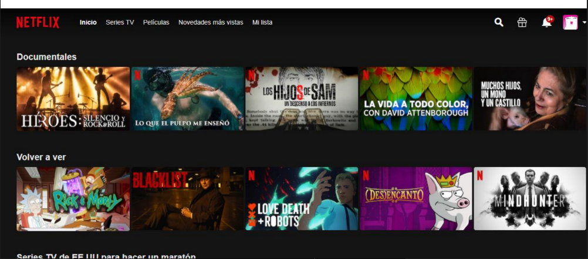

# Proyecto de ejercicios
### Presentación🚀
Esta es la segunda parte del tercer bloque de ejercicios del Bootcamp GeeksHubs Fronted and Angular que estoy cursando en Urbalab Gandía.

### Ejercicios 🤓

El proyecto consiste en hacer una réplica de la página de inicio de Netflix con Bootstrap.

La réplica que nos han pedido es esta:

https://rocardona.github.io/rcl-se04-bootstrap-09112022/

### Construido con 🛠️

### Agradecimientos 🍻
Agradecer a Urbalab y GeeksHubs por la oportunidad que nos estan dando👩‍💻
